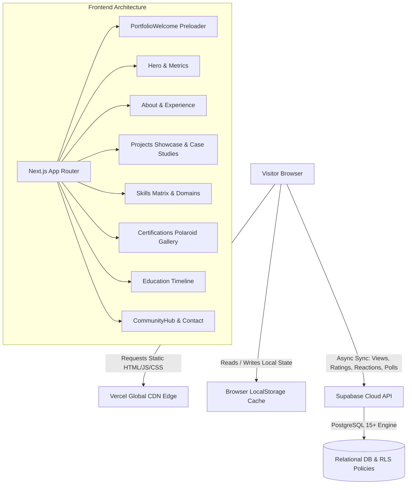

<div align="center">
  
</div>

<div align="center">

  [](https://nextjs.org/)
  [](https://www.typescriptlang.org/)
  [](https://tailwindcss.com/)
  [](https://www.framer.com/motion/)
  [](https://supabase.com/)
  [](https://vercel.com/)

  <br/>

  <h3>🌐 <a href="https://portfolio-sable-tau-b7ysjwnjns.vercel.app/">Explore Live Production Deployment</a></h3>

  <p>
    <b>Available for Full-Time Cloud & DevOps Roles & Semester Internships · Immediate Joiner</b>
  </p>

</div>

---

## 🌟 Overview & Engineering Philosophy

This repository contains the source code for the personal engineering portfolio of **Konda Balaji Rao** — Cloud & DevOps Engineer. Built from the ground up to reflect production infrastructure standards, the site combines ultra-fast static rendering, responsive micro-animations, real-time database synchronization via **Supabase**, and offline-resilient interaction loops.

---

## 🚀 Key Features & Architecture Highlights

### 1. ⚡ Precision Boot Sequence & Fast Mode Preloader
* **First Visit**: Displays a 5.0-second interactive cloud initialization boot sequence showcasing Docker, Jenkins, Terraform, and Helm terminal deployment logs.
* **Returning View / Reload**: Automatically detects page reload via the Navigation Timing API and switches to **3.0-second Fast Mode**.
* **Instant Skipping**: Fully accessible with `Escape`, `Space`, `Enter`, or the on-screen skip button.

### 2. 🤝 Multi-Channel Visitor Community Hub
Embedded directly in the Contact section, this hub offers 4 distinct ways for recruiters, peers, and mentors to interact:
1. **Direct Priority Reach Out**: Recruiter inquiry queue with opportunity type selection (specifically emphasizing **Cloud & DevOps Internships** alongside full-time positions).
2. **1-Click Skill Endorsements**: LinkedIn-style `+1 Endorse` counters for core competencies (Docker, Jenkins, AWS, Terraform, Kubernetes, Prometheus, Linux, FastAPI).
3. **Engineering Guestbook**: Public signature wall for technical endorsements and peer reviews, featuring verified visitor badges and in-UI entry deletion.
4. **DevOps Roadmap Poll**: Community voting mechanism prioritizing upcoming open-source labs (e.g., EKS Karpenter, ArgoCD GitOps, HashiCorp Vault DevSecOps, OpenTelemetry, Serverless AWS, MLOps KServe).

### 3. ⭐ Live Project Telemetry & 1-Click Emoji Reactions
* Real-time visitor view counters.
* Interactive 5-star rating system with instantaneous feedback toasts.
* 1-Click emoji reaction bar (`🚀 Ship it`, `🔥 Fire`, `💡 Insightful`, `🐳 Clean Containers`, `❤️ Loved it`).

### 4. 📸 Polaroid Photography Credentials Showcase
* Authentic analog darkroom developer effect with photo paper physics.
* Interactive filtering across Cloud & Industry, Hackathons, Competitive Coding, and Academic credentials.
* High-resolution lightbox modal with keyboard and click-away dismissal.

### 5. 🛡️ Resilient Hybrid Storage Architecture
* **Primary Source of Truth**: Cloud-hosted PostgreSQL on **Supabase** with Row-Level Security (RLS).
* **Zero-Downtime Fallback**: All components feature instantaneous local state updates and `localStorage` persistence, ensuring zero latency, instant UI responses, and offline operability even if external networks are unavailable.

### 6. 🌓 Accessible Dual-Theme Engine (Dark & Light Mode)
* Engineered with a custom design system tokenized in `globals.css`.
* Dark theme (`#0b0f19`) and light theme (`#f8fafc`) rigorously audited for **WCAG AAA / AA contrast compliance**.
* Inline theme script in `<head>` preventing Flash-of-Unstyled-Content (FOUC).

---

## 🏗️ System Architecture



---

## 🛠️ Technology Stack

| Domain | Technologies |
| :--- | :--- |
| **Framework** | [Next.js 16 (App Router)](https://nextjs.org/) |
| **Language** | [TypeScript 5.x](https://www.typescriptlang.org/) (Strict Mode) |
| **Styling** | [Tailwind CSS v4](https://tailwindcss.com/) with native `@theme` tokens |
| **Animations** | [Framer Motion 12](https://www.framer.com/motion/) |
| **Icons** | [Lucide React](https://lucide.dev/) |
| **Database** | [Supabase (PostgreSQL)](https://supabase.com/) |
| **Deployment** | [Vercel](https://vercel.com/) with Turbopack |

---

## ⚙️ Local Development Setup

### Prerequisites
* **Node.js**: v18.18.0 or newer
* **npm**: v9.0.0 or newer

### Installation

1. **Clone the repository:**
   ```bash
   git clone https://github.com/9046balaji/portfolio.git
   cd portfolio
   ```

2. **Install dependencies:**
   ```bash
   npm install
   ```

3. **Configure Environment Variables:**
   Create a `.env.local` file in the project root:
   ```env
   NEXT_PUBLIC_SUPABASE_URL=https://<YOUR-PROJECT-REF>.supabase.co
   NEXT_PUBLIC_SUPABASE_ANON_KEY=eyJhbGciOiJIUzI1NiIsInR5cCI6IkpXVCJ9...
   ```

4. **Start the development server:**
   ```bash
   npm run dev
   ```
   Open [http://localhost:3000](http://localhost:3000) in your browser.

5. **Build for Production:**
   ```bash
   npm run build
   ```

---

## 🗄️ Database Schema & Supabase Setup

All relational database schemas, indexes, and Row-Level Security (RLS) policies are consolidated in [`supabase-schema.sql`](./supabase-schema.sql).

### Tables Included:
* `projects` — Project registry and view counters.
* `project_views` — Deduplicated visitor view tracking.
* `project_ratings` — 1-to-5 star ratings with visitor hash validation.
* `project_reactions` — 1-click emoji reactions (`ship`, `fire`, `insightful`, `docker`, `heart`).
* `recruiter_inquiries` — Direct priority outreach form submissions.
* `guestbook_entries` — Verified visitor messages and technical endorsements.
* `roadmap_votes` — Production DevOps lab prioritization votes.
* `skill_endorsements` — Technical competency upvote tallying.

To initialize, paste the contents of `supabase-schema.sql` into the **[Supabase SQL Editor](https://supabase.com/dashboard)** and execute.

---

## 📁 Repository Directory Layout

```
konda-balaji-rao-portfolio/
├── public/
│   ├── assets/               # High-res profile portraits & resume PDF
│   └── certificates/         # Verified credential assets (AWS, PwC, AI, Hackathons)
├── src/
│   ├── app/
│   │   ├── globals.css       # Design tokens, themes & custom animation utilities
│   │   ├── layout.tsx        # Metadata, OpenGraph cards & theme hydration script
│   │   ├── page.tsx          # Homepage composition
│   │   └── projects/         # Deep-dive architecture case studies
│   │       ├── aura-bank/
│   │       ├── heartguard-ai/
│   │       ├── hospital-management/
│   │       ├── ml-showcase/
│   │       └── pdf-tools/
│   ├── components/
│   │   ├── About.tsx         # Bio, core values & proof highlights
│   │   ├── Certifications.tsx# Polaroid gallery with category filters
│   │   ├── CommunityHub.tsx  # Inquiries, skill endorsements, guestbook & poll
│   │   ├── Contact.tsx       # Direct reach-out channels & embedded hub
│   │   ├── Education.tsx     # Academic timeline & coursework
│   │   ├── Footer.tsx        # Footer credits & status indicators
│   │   ├── Hero.tsx          # Headline, metrics & immediate availability
│   │   ├── Navbar.tsx        # Sticky navigation & responsive theme toggle
│   │   ├── PortfolioWelcome.tsx # 5s/3s calibrated boot sequence preloader
│   │   ├── Projects.tsx      # Interactive project catalog with live ratings
│   │   ├── ProjectStats.tsx  # Views, stars, and emoji reactions widget
│   │   ├── Skills.tsx        # Compact 4-column Bento domain matrix
│   │   ├── ThemeProvider.tsx # Client theme context provider
│   │   └── ThemeToggle.tsx   # Smooth animated Sun/Moon toggle
│   └── lib/
│       ├── projects.ts       # Centralized project definitions & metadata
│       └── supabase.ts       # Supabase client singleton
├── supabase-schema.sql       # Complete DDL migration & RLS security rules
├── README.md                 # Main repository documentation
└── package.json              # Dependencies and scripts
```

---

## 👤 Author & Contact

**Konda Balaji Rao**  
*Cloud & DevOps Engineer*  
- 🌐 **Live Portfolio:** [portfolio-sable-tau-b7ysjwnjns.vercel.app](https://portfolio-sable-tau-b7ysjwnjns.vercel.app/)  
- 💼 **LinkedIn:** [linkedin.com/in/konda-balaji-rao](https://www.linkedin.com/in/konda-balaji-rao/)  
- 📧 **Email:** [balajikonda9046@gmail.com](mailto:balajikonda9046@gmail.com)  
- 📞 **Phone:** [+91 83096 36226](tel:+918309636226)  
- 💻 **LeetCode:** [leetcode.com/u/KBalajiRao](https://leetcode.com/u/KBalajiRao/)  
- 📍 **Location:** Andhra Pradesh, India (Open to Remote & Relocation)

---

## 📄 License

This project is open-source and available under the [MIT License](./LICENSE).
